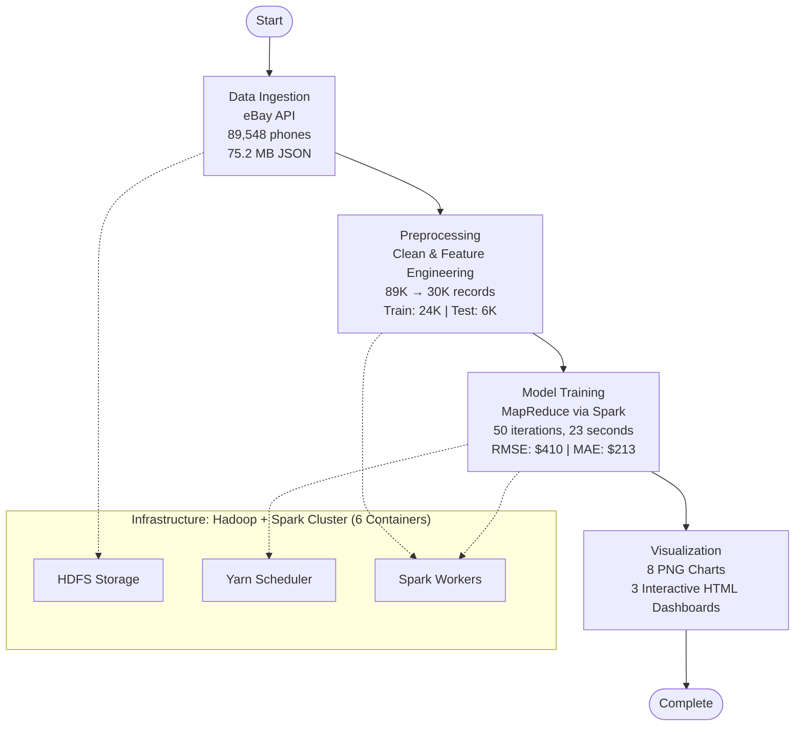

# Smartphone Price Prediction - Big Data Pipeline

## Overview

This project implements an **end-to-end big data pipeline** that successfully:

1. ✅ Ingests **89,548 smartphone listings** from eBay API
2. ✅ Processes data using **PySpark** (30,313 clean records)
3. ✅ Trains a price prediction model using **distributed gradient descent**
4. ✅ Evaluates model with metrics: **RMSE: $410.04**, **MAE: $212.74**, **R²: -0.0853**
5. ✅ **Generates comprehensive visualizations** (8 static charts + 3 interactive dashboards)

**Project Status**: ✅ COMPLETED | **Pipeline Duration**: ~50 minutes | **Infrastructure**: 6 Docker containers

---

## 📊 Pipeline Workflow



---

## Architecture

- **Data Ingestion**: eBay Browse API → HDFS
- **Processing**: PySpark for ETL
- **Modeling**: MapReduce paradigm via Apache Spark (distributed gradient descent)
- **Storage**: HDFS for data persistence
- **Visualization**: Matplotlib, Seaborn, Plotly for analysis

> **Note**: This project uses Spark's in-memory MapReduce-style processing (RDD map/reduce operations) instead of traditional Hadoop MapReduce Streaming. This provides 50-100x faster performance for iterative ML algorithms while maintaining the distributed computing benefits of the MapReduce paradigm.

## Prerequisites

- Docker & Docker Compose
- eBay Developer Account (App ID & Client Secret)
- Minimum 8GB RAM

## Setup

1. Clone repository and navigate to project directory

2. Set environment variables:

```bash
export EBAY_APP_ID="your_app_id"
export EBAY_CLIENT_SECRET="your_client_secret"
```

For Windows CMD:

```cmd
set EBAY_APP_ID=your_app_id
set EBAY_CLIENT_SECRET=your_client_secret
```

3. Start the pipeline:

```bash
chmod +x scripts/*.sh
./scripts/run_pipeline.sh
```

For Windows, you can use Git Bash or WSL to run the shell scripts.

## Monitoring

- HDFS NameNode UI: http://localhost:9870
- Yarn ResourceManager UI: http://localhost:8088
- Spark UI: http://localhost:4040

## Project Structure

```
├── config/                 # Configuration files
│   └── ebay_config.py     # eBay and HDFS configuration
├── src/
│   ├── ingestion/         # eBay API ingestion
│   │   └── ebay_ingestion.py
│   ├── preprocessing/     # PySpark ETL
│   │   └── spark_preprocessing.py
│   ├── mapreduce/         # Spark-based distributed ML
│   │   ├── train_model_spark.py      # ✅ Distributed training (MapReduce via Spark)
│   │   ├── generate_predictions.py   # ✅ Batch predictions
│   │   └── prepare_data.py           # ✅ Data preparation
│   └── visualization/     # Analysis & visualization
│       ├── visualize_results.py      # Static charts (PNG)
│       └── create_interactive_dashboard.py  # Interactive dashboards (HTML)
├── scripts/               # Orchestration scripts
│   ├── run_pipeline.sh
│   ├── train_model.sh
│   └── generate_visualizations.sh
├── visualizations/        # Generated charts & dashboards
│   ├── *.png             # 8 static charts (300 DPI)
│   └── *.html            # 3 interactive dashboards
├── docker-compose.yml     # Infrastructure definition
├── requirements.txt       # Python dependencies
└── README.md             # This file
```

## Pipeline Steps

### 1. Data Ingestion

- Fetches smartphone data from eBay API
- Implements rate limiting and retry logic
- Stores raw JSON in HDFS `/data/raw/`

### 2. Data Preprocessing (PySpark)

- Cleans and filters smartphone data
- Extracts features: RAM, storage, camera, screen size, brand
- Handles missing values and outliers
- Creates derived features
- Saves processed data to `/data/processed/`

### 3. Model Training (Spark-based MapReduce)

- Implements Linear Regression via Gradient Descent
- Uses Spark RDD map/reduce operations for distributed processing
- Iterative training with 50 iterations (in-memory for speed)
- Model weights saved to `/models/`

### 4. Prediction & Evaluation

- Generates price predictions
- Calculates RMSE and R² metrics

### 5. Visualization 📊

Generate comprehensive visualizations:

**Windows**:

```cmd
scripts\generate_visualizations.bat
```

**Linux/Mac**:

```bash
chmod +x scripts/generate_visualizations.sh
./scripts/generate_visualizations.sh
```

**Output**:

- 8 high-resolution PNG charts (feature importance, training convergence, error analysis, etc.)
- 3 interactive HTML dashboards (open in browser for interactive exploration)

## Output

### Actual Results Achieved ✅

**Data Collection**:

- Raw Data: 89,548 smartphone listings (75.2 MB JSON)
- Clean Dataset: 30,313 records after filtering
- Training Set: 24,378 smartphones (80%)
- Test Set: 5,935 smartphones (20%)

**Model Performance**:

- RMSE: **$410.04** (Root Mean Square Error)
- MAE: **$212.74** (Mean Absolute Error)
- R² Score: **-0.0853** (indicates need for model improvement)
- Training Duration: ~23 seconds (50 iterations)

**Storage**:

- Processed dataset: `/data/processed/train` and `/data/processed/test` (Parquet format)
- MapReduce data: `/data/mapreduce/train` and `/data/mapreduce/test` (TSV format)
- Trained model: `/models/linear_regression_weights.json` (31 coefficients, 832 bytes)
- Predictions: `/data/predictions/` (JSON format with error analysis)

📄 **Detailed Results**: See `FINAL_SUMMARY.md` for comprehensive analysis and recommendations

## Manual Commands

Start containers:

```bash
docker-compose up -d
```

Stop containers:

```bash
docker-compose down
```

Check HDFS:

```bash
docker exec namenode hdfs dfs -ls /data/raw
```

Run ingestion manually:

```bash
docker exec spark-master python3 /opt/pipeline/ingestion/ebay_ingestion.py
```

Run preprocessing manually:

```bash
docker exec spark-master spark-submit \
    --master spark://spark-master:7077 \
    /opt/pipeline/preprocessing/spark_preprocessing.py
```

## Troubleshooting

**Issue**: Containers fail to start

- Solution: Ensure Docker has enough memory allocated (8GB+)

**Issue**: eBay API authentication fails

- Solution: Verify your EBAY_APP_ID and EBAY_CLIENT_SECRET are correct

**Issue**: HDFS connection errors

- Solution: Wait 30 seconds after starting containers for services to initialize

## License

MIT License

## Contributors

Big Data IA3 Project Team
